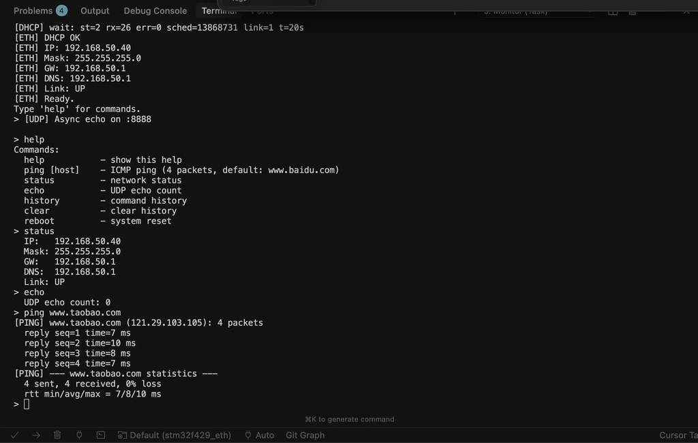

# PeterSerialTerminal - Enhanced Serial Terminal Library for Arduino

An enhanced serial terminal library for Arduino based on [ErriezSerialTerminal](https://github.com/Erriez/ErriezSerialTerminal), featuring command history, tab completion, larger buffers, and a modern interactive command-line experience.




## What's New

This enhanced version transforms your Arduino serial terminal into a modern, user-friendly command interface:

| Feature | ErriezSerialTerminal | PeterSerialTerminal |
|---|---|---|
| Receive buffer size | 32 bytes | **256 bytes** |
| Max command length | 8 characters | **12 characters** |
| Command history | No | **Yes (up to 20 entries)** |
| Arrow key navigation | No | **Yes (Up/Down)** |
| Tab completion | No | **Yes** |
| History management API | No | **Yes** |
| Backspace handling | Basic | **Enhanced (BS + DEL)** |
| Line editing & cursor control | No | **Yes** |
| Backward compatible | - | **100%** |

### Command History

Navigate through previously entered commands using arrow keys:
- **Up Arrow (↑)**: Recall previous command
- **Down Arrow (↓)**: Move to next command in history

Up to 20 commands are stored (128 bytes each). Duplicate consecutive commands are automatically skipped.

### Tab Completion

Press **Tab** to auto-complete commands:
- **Single match**: The command is completed automatically
- **Multiple matches**: All matching commands are displayed
- **No match**: A bell character is sent to the terminal

### Enhanced Terminal Editing

- Improved **backspace** support (handles both `^H` and `DEL` / ASCII 127)
- Automatic **character echoing** for terminal programs like PuTTY
- **Line clearing** and **cursor control** for seamless editing
- **Post-command handler** for custom prompts (e.g., `> `)

### Built-in History Management

Programmatic control over command history:

```c++
term.showHistory();   // Display all stored commands
term.clearHistory();  // Clear the history buffer
term.addToHistory("command"); // Manually add a command to history
```


## Supported Hardware

**Arduino:**
- UNO, Nano, Micro
- Pro / Pro Mini
- Mega / Mega2560
- Leonardo

**Other platforms:**
- Arduino DUE
- ESP8266 / ESP32
- SAMD21
- STM32F1


## Quick Start

### Installation

1. Download or clone this repository
2. Copy the folder to your Arduino libraries directory
3. Restart the Arduino IDE

### Basic Example

```c++
#include <PeterSerialTerminal.h>

SerialTerminal term('\r', ' ');

void setup()
{
    Serial.begin(115200);

    term.setSerialEcho(true);
    term.setDefaultHandler(unknownCommand);
    term.setPostCommandHandler(printPrompt);

    term.addCommand("help", cmdHelp);
    term.addCommand("on", cmdLedOn);
    term.addCommand("off", cmdLedOff);

    pinMode(LED_BUILTIN, OUTPUT);
    Serial.println(F("Type 'help' for usage."));
    printPrompt();
}

void loop()
{
    term.readSerial();
}

void printPrompt()
{
    Serial.print(F("> "));
}

void unknownCommand(const char *command)
{
    Serial.print(F("Unknown command: "));
    Serial.println(command);
}

void cmdHelp()
{
    Serial.println(F("Commands: help, on, off"));
}

void cmdLedOn()
{
    Serial.println(F("LED on"));
    digitalWrite(LED_BUILTIN, HIGH);
}

void cmdLedOff()
{
    Serial.println(F("LED off"));
    digitalWrite(LED_BUILTIN, LOW);
}
```


## API Reference

### Constructor

```c++
SerialTerminal term(newlineChar, delimiterChar);
```

| Parameter | Default | Description |
|---|---|---|
| `newlineChar` | `'\n'` | Newline character (`'\r'` or `'\n'`) |
| `delimiterChar` | `' '` | Separator between command and arguments |

### Command Registration

```c++
term.addCommand("cmd", callbackFunction);   // Register a command
term.setDefaultHandler(unknownHandler);      // Handler for unrecognized commands
term.setPostCommandHandler(promptFunction);  // Called after every command
```

### Serial I/O

```c++
term.readSerial();     // Process incoming serial data (call in loop())
term.setSerialEcho(true);  // Enable character echoing
```

### Argument Parsing

```c++
char *arg = term.getNext();       // Get next space-delimited argument
char *rest = term.getRemaining(); // Get all remaining characters
```

### Buffer & History

```c++
term.clearBuffer();     // Clear the serial receive buffer
term.showHistory();     // Print command history to Serial
term.clearHistory();    // Clear all history entries
term.addToHistory("cmd"); // Add a command to history manually
```


## Library Configuration

The following macros in `PeterSerialTerminal.h` can be adjusted:

| Macro | Default | Description |
|---|---|---|
| `ST_RX_BUFFER_SIZE` | 256 | Serial receive buffer size (bytes) |
| `ST_NUM_COMMAND_CHARS` | 12 | Max characters per command name |
| `ST_MAX_HISTORY_ENTRIES` | 20 | Max number of history entries |
| `ST_HISTORY_ENTRY_SIZE` | 128 | Max length per history entry (bytes) |


## Examples

| Example | Description |
|---|---|
| [ErriezSerialTerminal](examples/ErriezSerialTerminal/ErriezSerialTerminal.ino) | Basic usage with command registration and argument parsing |
| [ErriezSerialTerminal_EchoAndCallback](examples/ErriezSerialTerminal_EchoAndCallback/ErriezSerialTerminal_EchoAndCallback.ino) | Character echoing, post-command handler, and interactive prompt |


## Library Dependencies

None.


## License

MIT License. See [LICENSE](LICENSE) for details.


## Acknowledgments

This project is based on [ErriezSerialTerminal](https://github.com/Erriez/ErriezSerialTerminal) by Erriez. The original library provides an excellent, lightweight foundation for serial command parsing on Arduino. This enhanced version builds upon that solid foundation by adding command history, tab completion, extended buffers, and improved terminal editing — while maintaining full backward compatibility. Many thanks to the Erriez team for their outstanding work on the original library.
